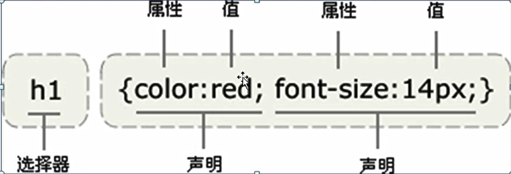

# study_css_系统学习之 css简介

[TOC]

## 什么是 css

 cascading style sheets 样式表，层叠样式表


##  css 的主要作用

从审美的角度 对html 页面进行美化


## css 代码的书写，语法规则




css 代码 是由选择器 和{} 组成

大括号里面是由一条一条声明语句组成

每一条语句的末尾 有一个英文的分号，最后一条语句的末尾分号 可有可无

每一条语句是由 属性：值 组成

语句中的属性值不需要加引号

如果属性的值是数字，通常都需要加单位 px(像素)


## 快速入门

```html
<head>
    <meta charset="UTF-8">
    <meta name="viewport" content="width=device-width, initial-scale=1.0">
    <title>Document</title>
    <style >
        div{
            color: #ff0000;
            font-size: 50px;
        }
    </style>
</head>
<body>
    <div>这是一片寂寞的天，下着有些忧伤的雨</div>
</body>
```


## 二、CSS 代码的书写方式

书写方式，指的是 css 代码在哪里写

css 代码的书写方式， 嵌入式，外链式， 行内式

### 2.1 嵌入式

什么是嵌入式：

​	指的是将css 代码直接签入在html 文件的 style 标签中

注意:
	在style


## CSS 文本属性

| 属性                                                         | 描述                                                        |
| ------------------------------------------------------------ | ----------------------------------------------------------- |
| [color](../cssref/pr_text_color.asp.htm)                     | 设置文本颜色                                                |
| [direction](../cssref/pr_text_direction.asp.htm)             | 设置文本方向。                                              |
| [line-height](../cssref/pr_dim_line-height.asp.htm)          | 设置行高。                                                  |
| [letter-spacing](../cssref/pr_text_letter-spacing.asp.htm)   | 设置字符间距。                                              |
| [text-align](../cssref/pr_text_text-align.asp.htm)           | 对齐元素中的文本。                                          |
| [text-decoration](../cssref/pr_text_text-decoration.asp.htm) | 向文本添加修饰。                                            |
| [text-indent](../cssref/pr_text_text-indent.asp.htm)         | 缩进元素中文本的首行。                                      |
| text-shadow                                                  | 设置文本阴影。CSS2 包含该属性，但是 CSS2.1 没有保留该属性。 |
| [text-transform](../cssref/pr_text_text-transform.asp.htm)   | 控制元素中的字母。                                          |
| unicode-bidi                                                 | 设置文本方向。                                              |
| [white-space](../cssref/pr_text_white-space.asp.htm)         | 设置元素中空白的处理方式。                                  |
| [word-spacing](../cssref/pr_text_word-spacing.asp.htm)       | 设置字间距。                                                |


如果是 HTML5 的文档， style 标签的 type 属性可以不写！

```
<style type="text/css">
<style >在html5中与上面一样
```

style 属性可以防止在 HTML 文件的 任意位置，不过一般放在 header 位置


## 2.2 外链式

单独写一个 以 .css 为扩展名的文件， 这个文件中就可以直接书写 css 代码

需要将这个 css 文件引入到 html 文件中 ， 通过link 标签引入

```
<head>
    <meta charset="UTF-8">
    <meta name="viewport" content="width=device-width, initial-scale=1.0">
    <title>Document</title>
    <link rel="stylesheet" href="./common.css">
</head>
<body>
    <p>这个是一个测试css 外链式文件代码</p>
</body>
```

```css
p{
    color: #ff0000;
    font: outline;
    size: 50px;
}
```


## 2.3 行内式

通过行内式来书写 css代码 写在标签的style 属性中

```html
 <p style="color: #ff0000;">行内样式test</p>
```


关于嵌入式与外链式 之间的优缺点

外链式更优：可以被多个 html 文件引用

