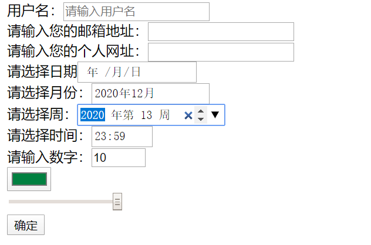

# study_html_系统学习之 HTML5 新增的语义化标签

[TOC]

## 语义化：

当我们看到这些标签时就能明白它其中的含义

我们在 html4 和XHTML 的始戴的时候要实现一个盒子，就要使用div 与span  标签，但是在 HTML5 中新增了语义化标签和div 标签同样功能的标签，但是这些标签具有语义化

```
header 头标签
nav	导航标签
aside	侧边栏标签
artide	文章标签
footer	页脚标签
section	栏目标签
```


## 表单控件中新增的属性

| 属性                 | 功能               |
| -------------------- | ------------------ |
| required             | 必填项内容不能为空 |
| placeholder="占位符" | 提示信息 占位符    |
| autofocus            | 自动获取焦点       |

```html
<form action="">
    <!-- 
如果将这个属性写在表单控件标签中就表示这个表单控件标签里面必须要有内容
-->
    用户名：<input type="text" required>
    <button type="submit">确定</button>
</form>
```


autofocus

```html
<form action="">
    <!-- 
如果将这个属性写在表单控件标签中就表示这个表单控件标签里面必须要有内容
-->
    用户名：<input type="text" required autofocus placeholder="请输入用户名">
    <button type="submit">确定</button>
</form>
```


表单控件 input 标签 新增的  type 属性值

这里新增的input 标签中的 type 属性值其实主要是用于移动端

| 属性值 | 功能            |
| ------ | --------------- |
| email  |                 |
| url    |                 |
| date   | 日期类型 年月日 |
| week   | 周类型          |
| time   | 小时，和分钟    |
| month  | 月类型          |
| color  | 颜色拾色器      |
| range  | 范围            |

```html
<form action="">
    <!-- 
如果将这个属性写在表单控件标签中就表示这个表单控件标签里面必须要有内容
-->
    用户名：<input type="text" required autofocus placeholder="请输入用户名"><br>
    请输入您的邮箱地址：<input type="email"><br>
    请输入您的个人网址：<input type="url"><br>
    请选择日期<input type="date"><br>
    请选择月份：<input type="month"><br>
    请选择周：<input type="week"><br>
    请选择时间：<input type="time"><br>
    请输入数字：<input type="number" min="10" max="20" step="3"><br>
    <input type="color"><br>
    <input type="range" min="0" max="255"><br>

    <button type="submit">确定</button>
</form>
```

