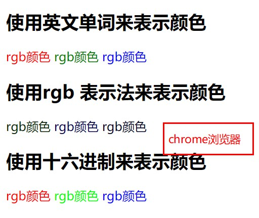
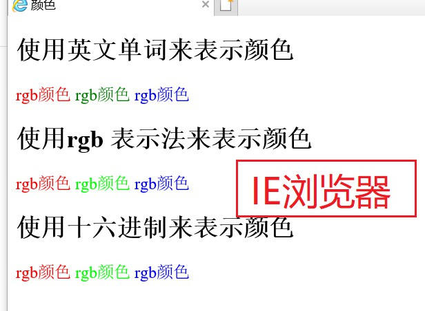

# study_html_系统学习之网页中的颜色表示方式

[TOC]

font

## 颜色的表示方式

英文单词：red	green 	blue

rgb(红, 绿, 蓝) , 取值范围 0~255

rgb 表示法：rgb(255, 0, 0), rgb(0, 255, 0), rgb(0, 0, 255), 

十六进制：#FF0000, #00FF00, #0000FF


### 三原色

自然界中有三种基本的颜色：红绿蓝，其RGB 色彩模式它的颜色都可以通过这三种基本色混合而成，它们又称之为 加色模式

在计算机同样也是有三种基本色：红绿蓝，值越大，颜色越深，值越小，颜色越浅


```html
<body>
    <h2>使用英文单词来表示颜色</h2>
    <font color="red">rgb颜色</font>
    <font color="green">rgb颜色</font>
    <font color="blue">rgb颜色</font>

    <h2>使用rgb 表示法来表示颜色</h2>
    <font color="rgb(255,0,0)">rgb颜色</font>
    <font color="rgb(0,255,0)">rgb颜色</font>
    <font color="rgb(0,0,255)">rgb颜色</font>

    <h2>使用十六进制来表示颜色</h2>
    <font color="#FF0000">rgb颜色</font>
    <font color="#00FF00">rgb颜色</font>
    <font color="#0000FF">rgb颜色</font>
</body>
```






建议颜色 最好使用 十六进制，兼容性最好